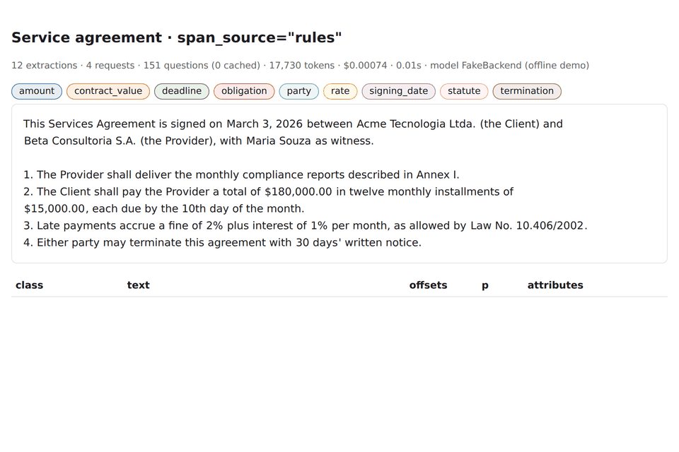

# typeExtract

**Grounded entity extraction with a typed-decision model instead of an LLM.**
Like [LangExtract](https://github.com/google/langextract): you describe what to extract, and you
get every mention back with its class, exact character offsets, attributes and a confidence.
Unlike LangExtract, no model ever *writes* the output. Code proposes candidate spans from the
text, and [Jev](https://typesafe.ai/blog/introducing-system-one-models-and-jev) (TypeSafe's
System One model) only *decides* which of them are mentions of your classes.

```python
import typeextract as tx

schema = tx.Schema(
    description="Service agreement",
    entities=[
        tx.Entity("party", "a company or person bound by the contract, by its proper name",
                  counter_examples=["the Client"],
                  attributes=[tx.Attribute("role", ["client", "provider"])]),
        tx.Entity("amount", "an amount of money to be paid"),
    ],
    sentence_labels=[tx.SentenceLabel("obligation", "creates a duty for one of the parties")],
    fields=[tx.Field("contract_value", "the total value of the contract", source="money")],
)

doc = tx.extract(open("contract.txt").read(), schema, model_id="jev-1.13.0")
for e in doc.extractions:
    print(e.extraction_class, e.extraction_text, e.start, e.end, e.confidence, e.attributes)
print(doc.fields["contract_value"].extraction_text)
```

<p align="center">
  
</p>

*The HTML view (`tx.save_html`) on four documents: a contract, a clinical note in `hybrid`
mode, news with a nested mention, and Chinese text. These frames come from the offline
`FakeBackend`, whose answers come from lookup tables, so they show the output format, not Jev's
accuracy (every probability reads 0.90). Run `python examples/make_demo.py` with a
`TYPESAFE_API_KEY` to regenerate the GIF from live Jev answers, or add `--offline` to rebuild
this version.*

Why decide instead of generate:

- **Grounded by construction.** `doc.text[e.start:e.end] == e.extraction_text` for every
  extraction. There is no alignment step that can fail and no hallucinated value.
- **A probability for every decision.** You get thresholds per class, a `needs_review` flag for
  close calls, and rejected spans kept with a reason for auditing.
- **Cheap and fast.** Jev costs $0.042 per million input tokens, output is free, and it answers in
  70–500 ms. Questions are batched so that a few hundred of them share one request.

## Install

```bash
pip install git+https://github.com/bug-ss/typeExtract          # + [yaml] for YAML schemas
export TYPESAFE_API_KEY=...                                     # https://console.typesafe.ai
typeextract check                                               # one tiny live call
```

Python 3.10+. The only runtime dependency is `httpx`.

## How it works

1. **Segment** the text into sentences with exact offsets. Hard-wrapped PDF lines are re-joined,
   while headings, list items and blank lines are kept as breaks. Consecutive sentences are
   grouped into ~800-character windows.
2. **Propose candidates** with code:
   - typed patterns (money, dates, times, percentages, emails, URLs, phones, quantities, IDs);
   - your classes' regexes, examples and gazetteers;
   - proper-noun runs ("Bank of America", "Dr. Smith", "Acme, Inc.");
   - content n-grams;
   - any custom generator you plug in (spaCy, GLiNER, …).
3. **Round 1:** one Jev `Choice` per candidate: *which entity type is this exact span a complete
   mention of, or `none`?* It is sent together with one `Noul` per sentence and sentence label.
4. **Round 2:** for the accepted spans only, a verification `Noul` plus each attribute
   (`Choice`, `Noul` or `Score`).
5. **Resolve in code:** thresholds, verification, overlaps (the most probable span wins, and the
   longer one wins a near-tie), and review flags.
6. **Fields** (single-valued slots): the field's candidates become the options of one `Choice`,
   *"which option is the contract value?"*, plus a `Noul` asking whether the text states it at all.

### Who finds the spans: `span_source`

| `span_source` | How candidates are found | Use when |
|---|---|---|
| `"rules"` (default) | The code generators above | Most documents; cheapest |
| `"jev"` | Jev is asked about every word: *is this word part of a mention of one of the entity types?* Tagged words form regions, and every region proposes itself and each sub-span. Typed patterns and your own `patterns` / `examples` / `terms` / custom generators still run; only the capitalisation and n-gram heuristics are switched off | Entities the heuristics can't anticipate: long lowercase phrases, punctuated citations, space-separated scripts other than English |
| `"hybrid"` | Both | Best recall; most questions |

<picture>
  <source media="(prefers-color-scheme: dark)" srcset="docs/assets/jev-mode-dark.svg">
  
</picture>

*One window in `jev` mode. Step 3 is why a region is not a span: "…disease and type 2 diabetes"
still yields both conditions, and "metformin 500 mg" yields "metformin" and "500 mg". The words,
regions, candidates and offsets are computed by the library's own code
([`examples/make_diagram.py`](examples/make_diagram.py)); the probabilities are illustrative
stand-ins for Jev's answers.*

Regions are not spans:
- "Paris, London" or "北京上海" still yield each city.
- "Bank of America" also yields "America", for `overlap="nested"`.
- `$`, `#`, `@` and `%` attached to a region are kept ("$1.2 billion", "12%").

Every candidate then goes through the same classification and verification rounds.

Tagging runs concurrently with classifying the code candidates, so it adds no sequential round
trip; only spans the code didn't propose get one more round. A failed tagging request follows
`on_error` without losing the code candidates. The cost is one extra question per word.
`tag_threshold` (default 0.3) is the recall knob: a word counts as tagged when Jev gives it at
least this probability. Scripts without spaces between words (Thai, Lao, Khmer) are not
segmented into words.

[docs/DESIGN.md](docs/DESIGN.md) has the full design and how each Jev limitation is handled.

## Handling Jev's limitations

| Jev limitation | What typeextract does |
|---|---|
| Cannot generate or find spans | Candidates come from code; Jev only chooses among them |
| At most 255 options per `Choice` | Tournament: groups of 254 + `none`, then a final round among the winners |
| One winner per `Choice` | Asks *what is this span?* per candidate, so any number of mentions can be found |
| Cannot count or index reliably | Spans are quoted, sentences are referenced by key (`text.S2`), repeats get an explicit occurrence |
| 64k tokens per request, 32k for state + one question | Packs questions into as many requests as needed. If Jev still rejects one as too large, it is split, re-packed, and later packing is more conservative |
| Accuracy drops with long, irrelevant state | Small windows; class definitions sent once per state |
| Rate limits, 429/529, timeouts, 5xx | Client-side request+token rate limiter shared by all threads, `retry-after` honoured, exponential backoff |
| Probabilities are not exact and vary between runs | Thresholds, `needs_review`, verification pass, answer cache for reproducible reruns |
| No normalisation or free text | Closed-set attributes (`Choice` / `Noul` / `Score`) plus `normalize=` hooks in code |

## Schema

In Python (above) or in YAML/JSON (`tx.Schema.load("schema.yaml")`); see
[examples/schemas/contract.yaml](examples/schemas/contract.yaml).

| Element | What it is | Jev question |
|---|---|---|
| `Entity(id, description, examples, counter_examples, terms, patterns, attributes, min_confidence, normalize)` | A span class. `examples` are shown to Jev *and* proposed as candidates; `terms` is a gazetteer that is only proposed; `patterns` are regexes that propose candidates | one `Choice` per candidate |
| `Attribute(name, options)` / `kind="bool"` / `kind="score"` | A closed-set property of an entity | `Choice` + `unknown` / `Noul` / `Score` (2–10 levels) |
| `SentenceLabel(id, description)` | A sentence-level class; a sentence may carry several | one `Noul` per sentence |
| `Field(id, description, source, patterns)` | One value per document. `source` is `"any"`, a pattern kind (`money`, `date`, `email`, …) or an entity id | `Choice` over the candidates + `Noul` "is it stated?" |

The descriptions are the whole specification. Say what a class excludes, and use
`counter_examples`: Jev reads definitions literally.

### LangExtract-style call

```python
doc = tx.extract(
    text,
    prompt_description="Extract characters and emotions.",
    examples=[tx.ExampleData(
        text="ROMEO. But soft! What light through yonder window breaks?",
        extractions=[tx.Extraction("character", "ROMEO", attributes={"emotional_state": "wonder"})],
    )],
)
```

Classes come from the examples. Attribute values seen in the examples become that attribute's
closed option set, since Jev cannot invent new values.

## Output

`AnnotatedDocument` contains:
- `text`, `extractions` (entities and sentence labels, in document order) and `fields`;
- `rejected`: spans dropped for `low_confidence`, `verification`, `overlap` or `not_stated`;
- `errors`: failed windows when `on_error="skip"`;
- `metrics`: requests, questions, cache hits, tokens, cost, retries, splits and latency;
- `model`: the model version that answered.

Each `Extraction` has:
- `extraction_class`, `extraction_text`, `char_interval` (`start` / `end`);
- `confidence` and the full `probabilities` distribution;
- `attributes` and `attribute_confidence`;
- `scores` (`verify`, `margin`, `exists`);
- `needs_review`, `normalized` and `sources` (which generators proposed the span).

```python
tx.save_jsonl(docs, "out.jsonl"); docs = list(tx.load_jsonl("out.jsonl"))
tx.save_html(doc, "doc.html")      # self-contained highlighted view
```

## Production use

```python
ex = tx.Extractor(
    schema,
    model="jev-1.13.0",            # pin a version: `jev-latest` can change under you
    cache=".typeextract-cache.sqlite",  # identical questions are never paid for twice
    max_cost_usd=25.0,             # stop before the next request would exceed the budget
    on_error="skip",               # a failed window is recorded in doc.errors; the rest continue
    max_concurrent_documents=8,
)
docs = ex.extract_many(texts)       # ordered; also accepts {"text", "document_id"} dicts
ex.close()                          # or use `with tx.Extractor(...) as ex:`
print(ex.metrics)                   # cumulative requests / tokens / cost / retries / splits

async for doc in ex.aextract_many(huge_iterable):   # async, bounded memory
    ...
```

- **Reliability.**
  - `408`, `429`, `5xx`, `529`, timeouts and connection errors are retried with backoff, and
    `retry-after` is honoured.
  - Authentication and budget errors stop the run even with `on_error="skip"`.
  - With `on_error="raise"`, `ExtractionError.document` holds the partial result.
- **Throughput.**
  - `JevBackend(requests_per_minute=1200, tokens_per_second=250_000, max_concurrency=16)` paces
    requests client-side, with one limiter shared by every thread using the extractor.
  - Lower these if your account's limits are lower.
- **Limits.** `tx.Limits(request_tokens=64_000, state_plus_question_tokens=32_000, max_questions=200)`
  controls packing. Tokens are estimated conservatively on the client (about 3 UTF-8 bytes per
  token).
- **Safety and connection reuse.**
  - A single `Extractor` can be shared between threads and used from inside a running event loop
    (notebooks, FastAPI).
  - Sync calls run on one private background event loop, so they share a single connection pool.
    `close()` releases it.
  - Document text is only ever sent as data, never as part of an instruction.
  - A failing custom generator follows `on_error` like any other failure.
- **Recall.** Candidates bound recall: an entity no generator proposes cannot be found. For
  irregular domains, add `patterns`/`terms` to the entity or plug in a generator:

  ```python
  def spacy_chunks(text, start, end):            # (text, sentence_start, sentence_end) -> spans
      for chunk in nlp(text[start:end]).noun_chunks:
          yield start + chunk.start_char, start + chunk.end_char
  ex = tx.Extractor(schema, candidate_generators=[spacy_chunks])
  ```
- **Tuning knobs:**
  - `window_chars`, `context_chars`, `max_ngram`, `max_candidates_per_sentence`;
  - `verify`, `overlap` (`"none"` / `"nested"` / `"all"`);
  - `review_threshold`, `review_margin`, `stopwords` (`"en"`, `"multi"` or your own set).
- **Testing without the API.** `typeextract.testing.FakeBackend` answers from lookup tables, so
  you can unit-test schemas and pipelines offline.

## CLI

```bash
typeextract extract docs/*.txt -s schema.yaml -o out.jsonl --html out/ --cache .cache.sqlite --max-cost 5 --span-source hybrid
typeextract visualize out.jsonl -o out/
typeextract check
```

## Limitations

- Jev is a hosted API: text is sent to TypeSafe. It is text-only and most accurate in English.
  CJK text is tokenised per character but is less tested.
- It never normalises or infers values: what you get is always a span of the input. Normalise in
  code with `normalize=`.
- Entities cannot cross sentence boundaries. Candidate generation, not Jev, sets the recall
  ceiling.
- The pipeline is covered by an offline test suite, including a mock server that enforces the
  API's rules. The prompts and defaults have **not yet been benchmarked against live Jev**: tune
  thresholds on your own labelled documents before relying on them.

## Development

```bash
python -m venv .venv && .venv/bin/pip install -e ".[dev]"
.venv/bin/pytest            # offline; no API key needed
python examples/quickstart.py --offline
python examples/make_demo.py --offline   # rebuilds docs/assets/demo.gif (needs Pillow and Chrome/Chromium)
python examples/make_diagram.py          # rebuilds docs/assets/jev-mode.svg and jev-mode-dark.svg
```
